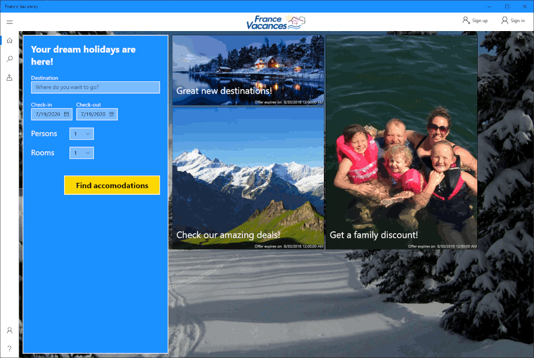

# FranceVacances

An application for browsing, searching, and booking accommodations in France. A mandatory group project on the 1st semester of Computer Science program at Erhvervsakademi Sjælland.

## Preview

The application was created over a span of 5 weeks. It was created for a fictional company called France Vacances. A Rational Unified Process was followed throughout the course of the project.

The application is built using C# programming language, .NET Framework, and Universal Windows Platform. It connects to an FTP server for retrieval and persistence of data.

The repository contains the source code of the application, unit tests, as well as project report and diagrams.

## Features

- News on the home screen
- Searching and filtering of accommodations
- Catalogue of locations
- Booking of accommodations
- Saving of user details and autofill
- Signup and login system

## Authors

- [Donatas Adamonis](https://github.com/DonatasAd)
- [Mikkel Frederiksen](https://github.com/Mifd39)
- Rasmus Lunddahl Overbye
- Simonas Valaitis
- [Marcin Zelent](https://github.com/marcinzelent)
